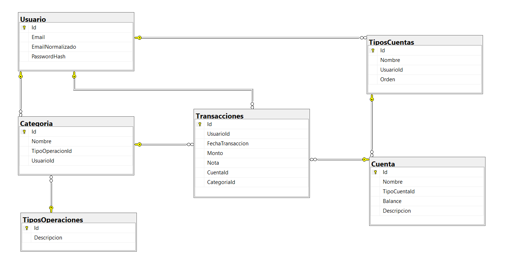

# FinAnt 🐜

FinAnt es una web diseñada para el seguimiento de ingresos y egresos. En la cual se implementó una arquitectura MVC usando C# y ASP.NET Core como lenguaje y framework principal, respectivamente. Para la gestión de la base de datos, se utilizó SQL Server, complementando dicho desarrollo con tecnologías como Dapper, Razor Pages, Bootstrap y jQuery.

Pantalla de inicio:

## Base de Datos

El proyecto utiliza SQL Server como sistema de gestión de base de datos. A continuación se hace un breve descripción de cada entidad utilizada: 

- **Usuarios**: Almacena información de los usuarios de la aplicación.
- **Transacciones**: Registra los ingresos y egresos de los usuarios.
- **Cuenta**: Registra la cuenta perteneciente de donde el usuario realizo una transacción

Para el acceso y manipulación de datos, el proyecto hace uso de Dapper, un micro ORM que facilita el mapeo entre la base de datos y los objetos de la aplicación, ofreciendo una alta eficiencia en las operaciones de base de datos.

