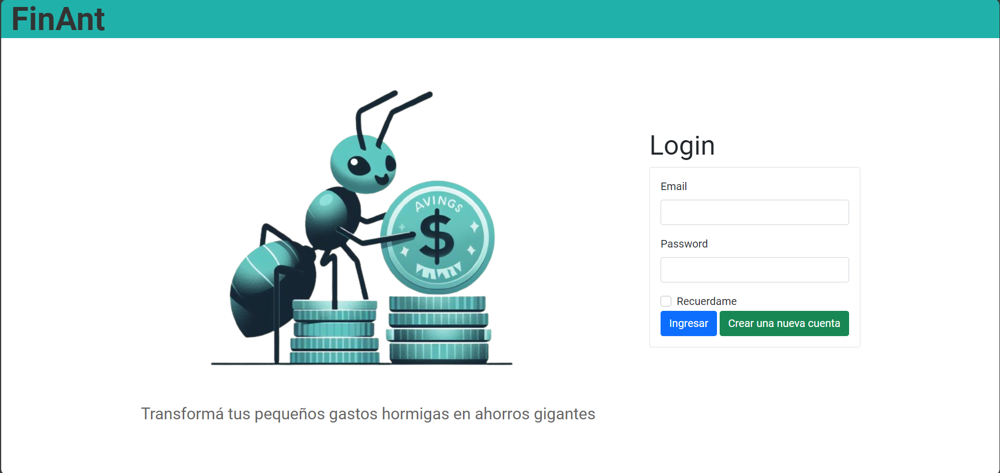
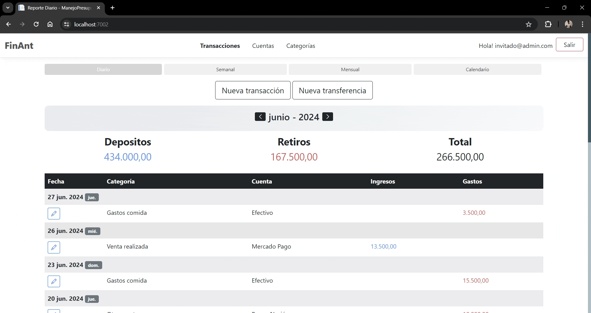
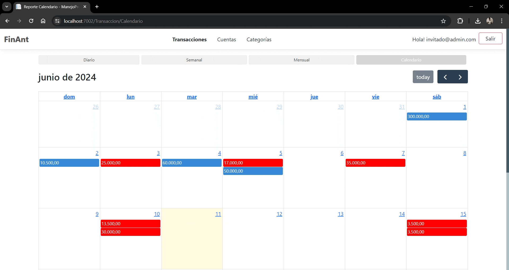
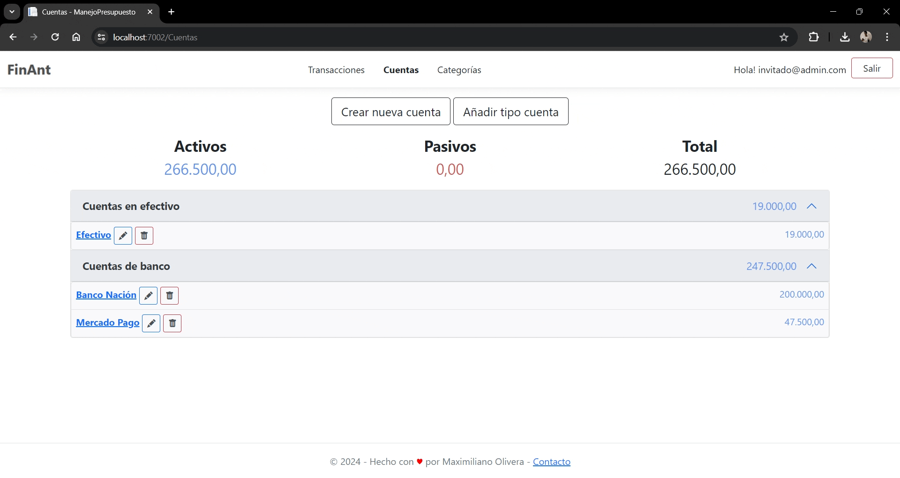
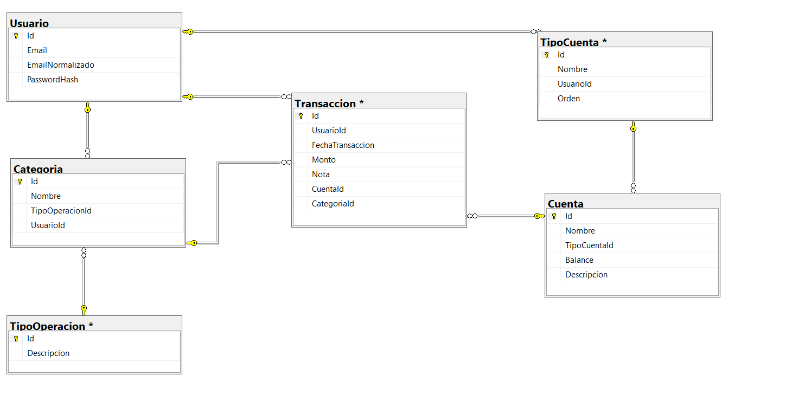

# FinAnt 🐜

## Resumen

FinAnt es una página web diseñada para el seguimiento y control de ingresos y egresos personales, brindando una solución práctica para mantener sus finanzas organizadas. Con una interfaz intuitiva, esta aplicación permite llevar un registro detallado de sus transacciones, establecer categorías personalizadas y obtener una visión general clara de su situación financiera.

**Características principales:**
- Registro de ingresos y egresos
- Categorización de transacciones
- Gestión de cuentas 
- Resumen de finanzas por períodos de tiempo
- Autenticación y autorización de usuarios

**Tecnologías utilizadas:**
- Lenguaje de programación: C#
- Framework: ASP.NET Core
- Patrón de arquitectura: Modelo-Vista-Controlador (MVC) con una capa adicional de servicios donde se implementa el patrón de repositorio
- Base de datos: SQL Server
- ORM: Dapper (Micro ORM para acceso a datos)
- Páginas web: Razor Pages
- Diseño y maquetación: Bootstrap, jQuery

  
  
  

## Base de Datos

El proyecto utiliza SQL Server como sistema de gestión de base de datos. A continuación se hace un breve descripción de cada entidad utilizada: 

- **Usuario**: Almacena información de los usuarios de la aplicación.
- **Transaccion**: Registra los ingresos y egresos de los usuarios.
- **Cuenta**: Registra la cuenta perteneciente de donde el usuario realizo una transacción.
- **TipoCuenta**: Registra una clasificación para agrupar las diferentes cuentas.
- **Categoria**: Registra una clasiicación a la que puede pertenecer una transacción.
- **TipoOperación**: Define el estado de una categoría, si es un ingreso o gasto.  

En esta aplicación, Dapper se utiliza en los repositorios para interactuar con la base de datos. Los repositorios implementan interfaces que definen los métodos necesarios para realizar operaciones en las diferentes entidades. Gracias a Dapper, estas operaciones se ejecutan de manera eficiente mediante consultas SQL y procedimientos almacenados. Al combinar Dapper con el patrón de repositorio, se logra una separación clara entre la lógica de acceso a datos y el resto de la aplicación.

